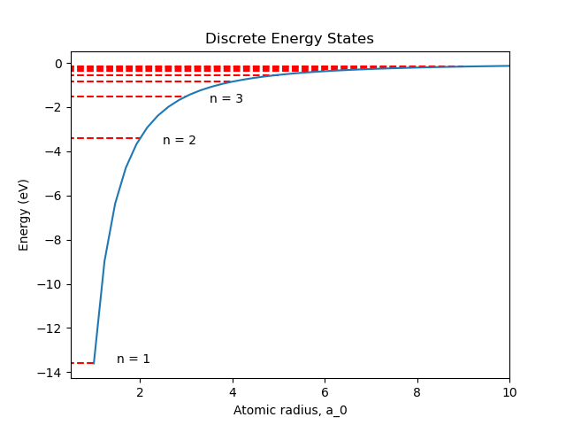
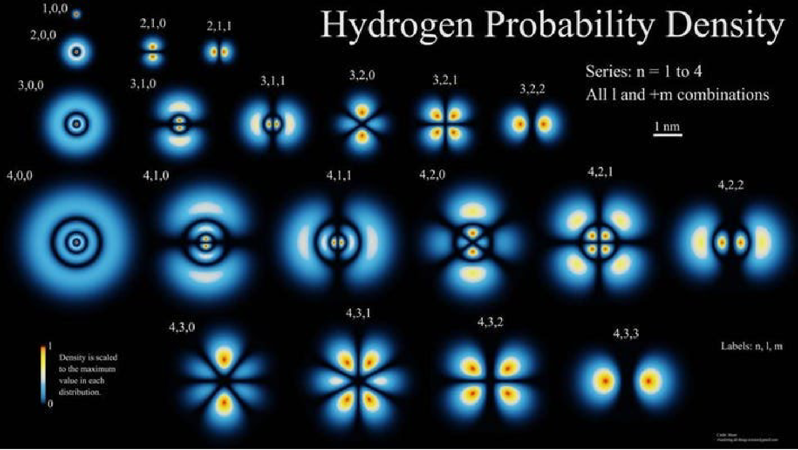

# Atomic and Molecular Physics

"Periodic Table of Elements.csv" https://gist.github.com/GoodmanSciences/c2dd862cd38f21b0ad36b8f96b4bf1ee

## Part 1

### Z

Z = 1 for neutral atoms
Z = ion count + 1

### Rydberg 

### Energy Levels

The energy eigenvalues, E, can be determined using the Schrodinger equation $$\hat{H} \Psi = E \Psi$$ Which leads to a set of $E_n$ given by

$$E_n = -\frac{m_e Z^2_{core} e^4}{32 \pi^2 \epsilon^2_0 \hbar^2 n^2}$$

where n = 1, 2, 3, ... is the principle quantum number.

.**Figure. 1** Electronic energy levels and Coulomb potential.

### Emission

### Absorption

### Spectrum Generation

### Reduced Mass

### Radial

$$R_{n, l} = N_{n, l} (\frac{2}{n a_0} r)^l exp(-\frac{1}{n a_0} r) L^{2l+1}_{n-l-1} (\frac{2}{n a_0} r)$$

Where $$N_{n, l} = $$

and $$L $$

### Angular Momentum

