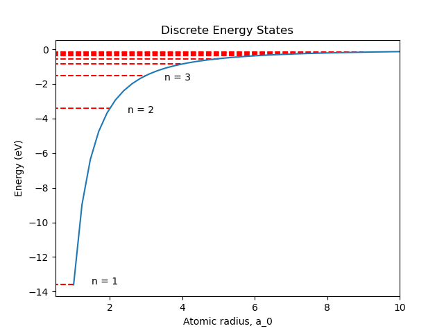

# Atomic and Molecular Physics

"Periodic Table of Elements.csv" https://gist.github.com/GoodmanSciences/c2dd862cd38f21b0ad36b8f96b4bf1ee

## System

Atom class
- name
- symbol
- composition
- mass
- charge
- ions
- 

#### Units

- eV
- $cm^{-1}$

## Part 1

#### Zcore

Z = 1 for neutral atoms
Z = ion count + 1

#### Rydberg 

#### Energy Levels

$E_n = -\frac{m_e Z^2_{core} e^4}{32 \pi^2 \epsilon^2_0 \hbar^2 n^2}$

#### Emission

#### Absorption

#### Spectrum Generation

#### Reduced Mass

#### Radial

#### Angular Momentum